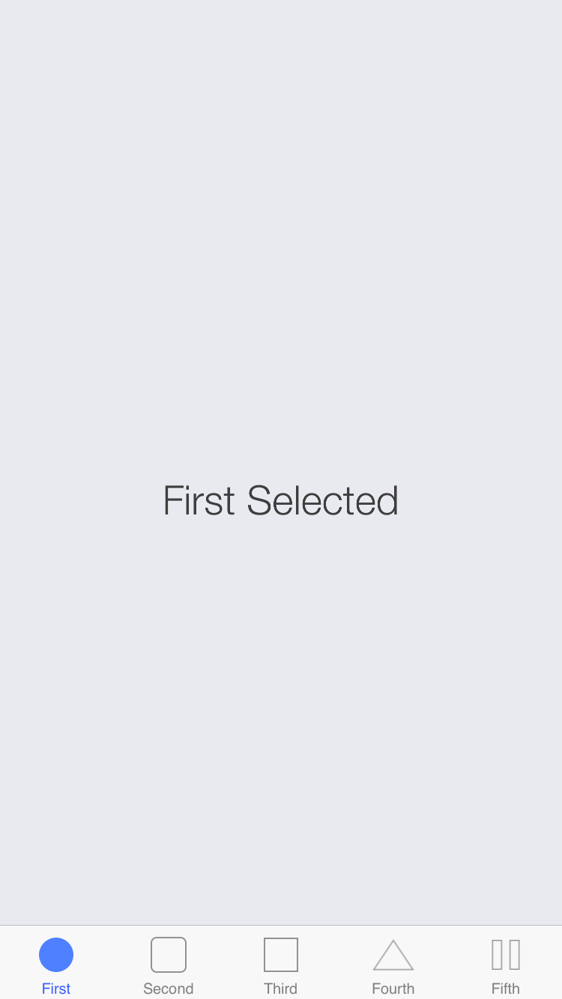

form-tabbar
===========

Responsive iOS UITabBar Template for the prototyping tool Form (by Relative Wave)

My goal, by opensourcing this project, is to make it easier and faster for designers to start with a project that requires use of the native iOS Tab Bar.

Enjoy responsibly and build something awesome! (it would be nice if you would email me and let me know what you built with this template)

## Features
- Looks and behaves **exactly** as the Apple's own iOS UITabBar (I realize that this is a bold statement, but go and see for yourself)
- Fully responsive (works on iPhone 5S, iPhone 6, iPad Air, ...)
- Fully customizable (easily update the icons, labels and tint of your UITabBar items)

## How to Use
- Download the **UITabBar Controller.form**
- Open the file in Form and stream it to your iOS device through the Perform client
- Have fun!

## Dependencies
Requires [Form](https://itunes.apple.com/us/app/form/id906164672?mt=12 "Form") 

## Known Issues
- Currently works only with 5 UITabBar Items and doesn't include the middle action button (can't expect magic sparkles and unicorns from a vanilla Tab Bar template)
- I am overriding default state (when you launch the prototype) on high level which may not be ideal
- Prototype was not tested on devices with @1x and @3x displays
- You have to tint the icons on your own

## FYI
- Color of the default state for the labels and icons is #929292 or 146, 146, 146 (rgb)  

*NOTE: This template may be a little messy and hacky as I have started this project a while ago while I was still learning basics of prototyping (and finally decided to release it immediately without any further enhancements.) Oh and UINavigationBar template is in the works!*

